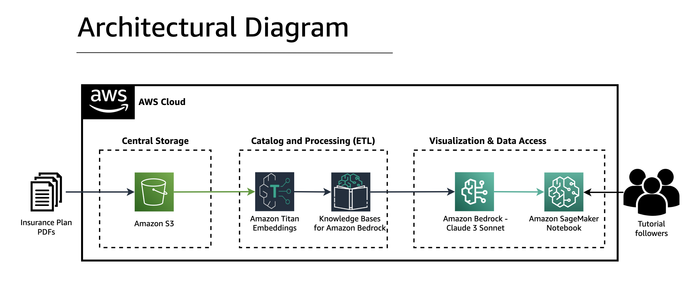

# Personalized Patient Experience with Digital Front Door

This repository contains code examples and utilities for implementing personalized experiences for healthcare members through a digital front door solution, leveraging AWS services like Amazon Bedrock and OpenSearch Serverless.

## Overview

The code demonstrates two approaches to personalize the digital front door experience:

1. **Leveraging a Vector Database**: This approach uses OpenSearch Serverless as a vector database to store and retrieve personalized information based on a member's plan details.

2. **Leveraging Knowledge Bases from Amazon Bedrock**: This approach utilizes Amazon Bedrock's Knowledge Bases to store and retrieve personalized information based on metadata filters.

## Prerequisites

Before running the code, ensure that you have the following prerequisites:

- AWS account
- Python 3.7 or later
- Required Python packages (e.g., boto3, pandas, etc.)

## Installation

1. Clone the repository:

```
git clone https://github.com/aws-samples/aws-patient-digital-front-door.git
```

2. Install the required Python packages:

```
pip install -r requirements.txt
```
## Architecture



## Contributing

Contributions are welcome! If you find any issues or have suggestions for improvements, please open an issue or submit a pull request.

## License

This project is licensed under the [MIT License](LICENSE).

## Acknowledgments

- [AWS Samples](https://github.com/aws-samples)
- [Amazon Bedrock Documentation](https://docs.aws.amazon.com/bedrock/latest/APIReferenceGuide/Welcome.html)
- [OpenSearch Serverless Documentation](https://docs.aws.amazon.com/opensearch-service/latest/developerguide/serverless.html)